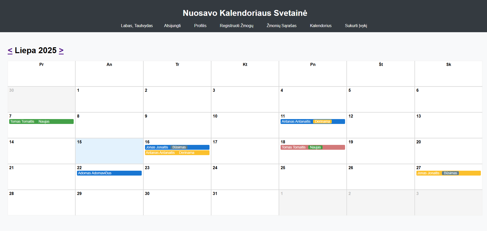
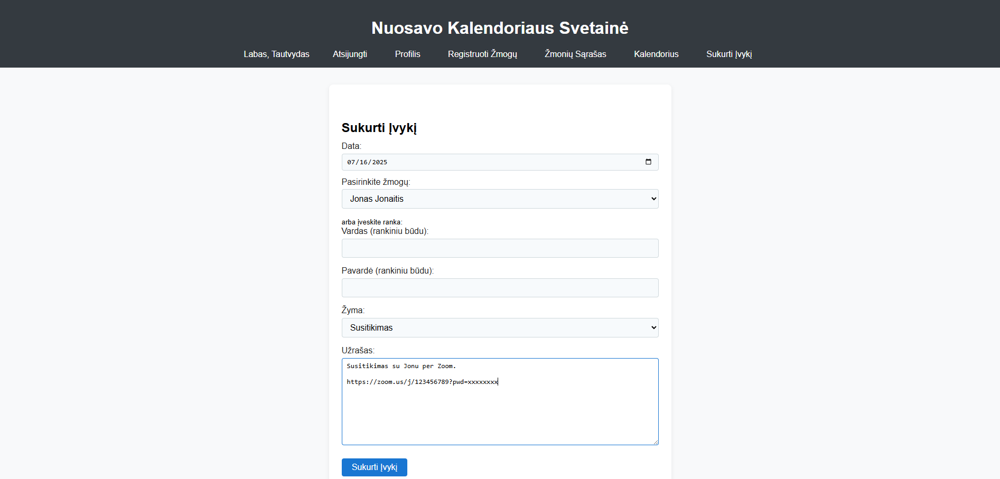
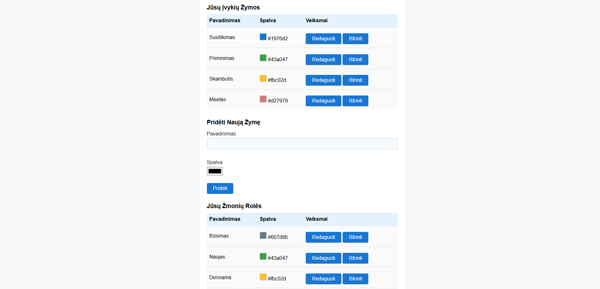
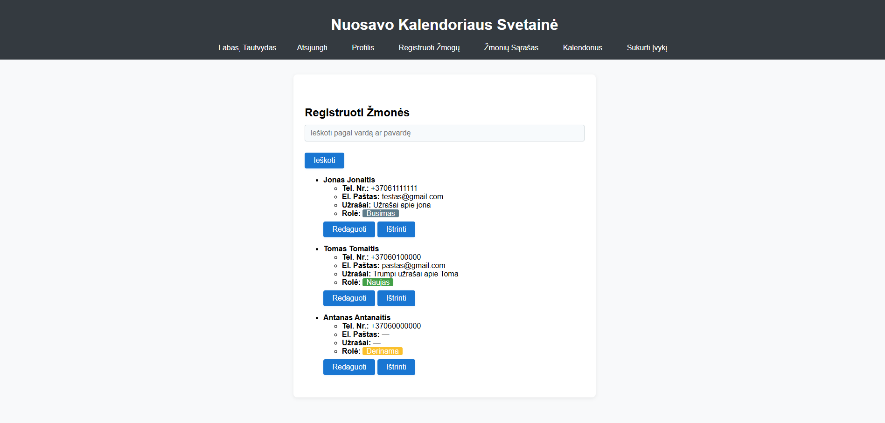
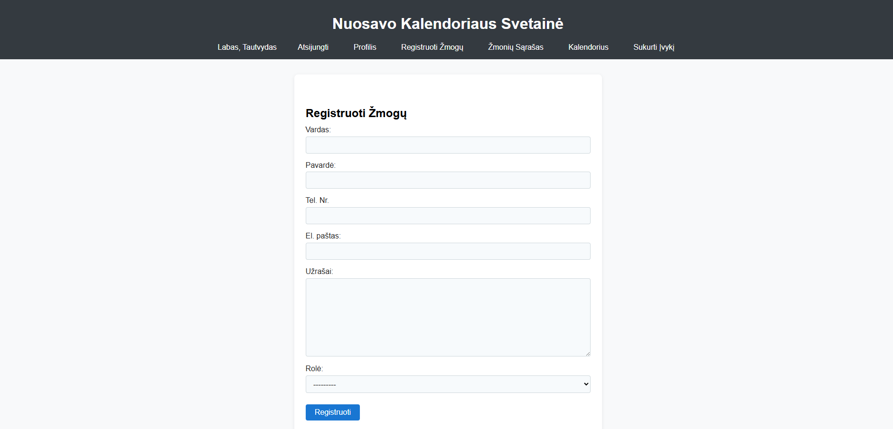

# Django Calendar Application

## Overview

This project is a web-based calendar and client management system built with Django. It allows users to register people, assign customizable roles and tags, create and manage calendar events, and view events in a weekly or monthly calendar format. The application is designed for personal or small business use, enabling efficient scheduling and tracking of interactions with clients or contacts.

---

## Features

- **User Authentication:** Secure login/logout and profile management.
- **Client Registration:** Add people with contact details, notes, and assign roles.
- **Customizable Roles & Tags:** Create, edit, and delete roles and event tags with color coding for easy identification.
- **Calendar View:** Interactive calendar displaying events, with week and month navigation.
- **Event Management:** Create, edit, and view detailed events linked to people and tags.
- **Role Highlighting:** Display person roles in colored boxes next to their names in the calendar.
- **Responsive Design:** Optimized for desktop and mobile devices.
- **Password Change:** Users can change their password from the profile section.
- **Admin Panel:** Manage users, roles, tags, and events via Django admin.

---

## Technology Stack

- **Backend:** Django (Python)
- **Frontend:** HTML, CSS (custom and Django templates)
- **Database:** PostgreSQL (recommended for deployment), MySQL (supported for local development)
- **Authentication:** Django's built-in user system
- **Static Files:** WhiteNoise for serving static files in production
- **Deployment:** Render.com (cloud hosting)

---

## Project Structure

```
.
├── README.md
├── render.yaml
├── django-calendar-app/
│   ├── manage.py
│   ├── requirements.txt
│   ├── calendar_app/
│   │   ├── models.py
│   │   ├── views.py
│   │   ├── forms.py
│   │   ├── urls.py
│   │   ├── templates/
│   │   │   └── calendar_app/
│   │   │       ├── base.html
│   │   │       ├── calendar.html
│   │   │       ├── profile.html
│   │   │       ├── event_detail.html
│   │   │       ├── person_registration.html
│   │   │       └── person_list.html
│   │   │       └── ...
│   │   └── static/
│   └── django_calendar_app/
│       ├── settings.py
│       ├── urls.py
│       └── wsgi.py
└── staticfiles/
```

---

## Installation

1. **Clone the repository:**
   ```sh
   git clone <repository-url>
   cd django-calendar-app
   ```

2. **Create a virtual environment:**
   ```sh
   python -m venv venv
   source venv/bin/activate  # On Windows use `venv\Scripts\activate`
   ```

3. **Install dependencies:**
   ```sh
   pip install -r requirements.txt
   ```

4. **Configure environment variables:**
   - Create a `.env` file or set variables in your shell:
     ```
     DJANGO_SECRET_KEY=your-secret-key
     DJANGO_DEBUG=False
     DATABASE_URL=url-to-DB
     ```

5. **Run migrations:**
   ```sh
   python manage.py makemigrations
   python manage.py migrate
   ```

6. **Create a superuser (optional):**
   ```sh
   python manage.py createsuperuser
   ```

7. **Start the development server:**
   ```sh
   python manage.py runserver
   ```

## Deployment (Render.com)

### Prerequisites

- [Render account](https://render.com/)
- GitHub repository with your code

### Steps

1. **Push your code to GitHub.**
2. **Create a PostgreSQL database on Render:**
   - Go to "New +" → "PostgreSQL"
   - Copy the Internal Database URL.
3. **Create a new Web Service:**
   - Connect your repo.
   - Set environment variables:
     - `DJANGO_SECRET_KEY` (Render can generate)
     - `DJANGO_DEBUG` = `False`
     - `DATABASE_URL` = (Paste your Internal Database URL)
   - Set the start command to:
     ```
     gunicorn django_calendar_app.wsgi:application
     ```
   - Render will auto-detect and use your `render.yaml` if present.
4. **Run migrations:**
   - On free plans, temporarily set the build/start command to:
     ```
     pip install -r requirements.txt && python manage.py migrate
     ```
   - Deploy, then revert to the normal start command and redeploy.
5. **Access your deployed app at the provided Render URL.**

---

## Visuals

**Calendar page**


**Event creation page**


**Event tag and user role edit page**


**User list page**


**User creation page**
